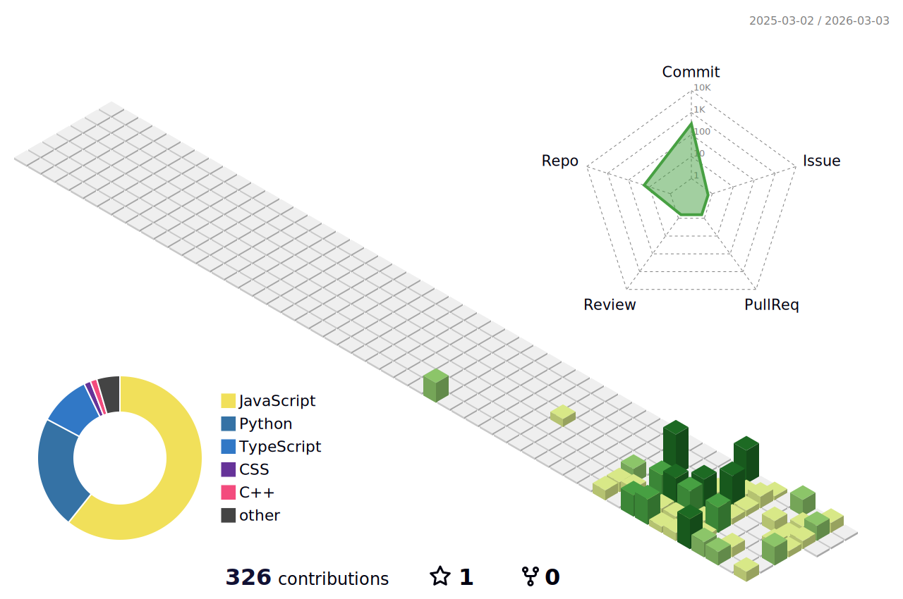

  
<!-- You can create a custom banner using Canva.com with these dimensions: 1500x500px -->
<!-- Upload it to your repository and replace the URL below -->
<!-- Example:  -->

# Hello, folks 👋

My name is Muskan & I am a Software Engineer Karachi, Pakistan. I specialize in MERN Stack & React Native development, building scalable web and mobile applications. My passion for creating innovative solutions drives me, and I like to follow best practices whenever possible.

I have gained hands-on experience in both Django and MERN Stack development. I like to be able to create full-stack applications that solve real-world problems. This allows me to keep both my Backend & Frontend skills sharp and thinking.

I am enthusiastic about Artificial Intelligence, always eager to learn and explore cutting-edge technologies.

Want to know more about me? Check out my [portfolio](https://your-portfolio-url.com).

 

---

## 🌐 Socials:

 

---

## 🛠️  Languages and Tools:

 

---

## 🎓 Academic Performance:

 **NED University of Engineering & Technology**
- 📚 Bachelor of Software Engineering (Expected 2027)
- 🏆 3rd Year Student
- 💡 Focus: Full-Stack Development, Database Systems, Software Architecture

---

## 📈 My Contributions:

[comment]: <> (Snake eating my contributions)

  
    

[comment]: <> (3D Commit Contribution Graph)

  

  
